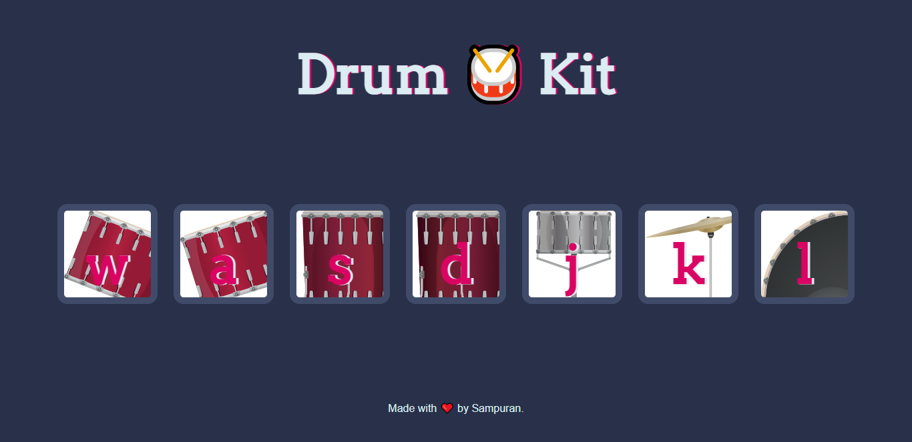

# 1.) Dice Game
A simple dice game created using HTML, CSS and JavaScript

# Idea
* To create and build a simple game using JavaScript
* Used simple query selectors, math function and random function in JavaScript to implement the game.

# How to Play
* Press the refresh button (F5) to refresh the page.
* If the number on the dice of player 1 is greater than the number on the dice of player 2, then player 1 wins
* If the number on the dice of player 1 is less than the number on the dice of player 2, then player 2 wins
* If the number on the dice of player 1 is equal to the number on the dice of player 2, then it is a draw

# Screenshots

# 2.) Drum-Kit
A basic website that uses HTML, CSS and JavaScript to create drum sounds on a click.

# About Drum-Kit
A website where a user can use mouse or keyboard buttons to play different sounds of the drums. Each drum has a different sound and the user also gets an indication of which drum gets played.

# Tools Used
Used JavaScript event handlers, animations and audio files for the drum sound. Also used HTML5 and CSS3.

# Screenshots

# 3.) Simon-Game
The famous Simon Game using HTML, CSS and jQuery.

# Idea
* To build and develop an advanced game which is easy to play using jQuery.
* Used event handlers, animations and audio files to develop the game.

# How to Play
* Press any key to start
* Check the button that is blinked (say red)
* The player has to press that button. As soon as the player presses a button, another button get blinked (say green)
* Now, the player needs to press on the red button and then on the green button. 
* In the next level, if the yellow button is blinked, the player needs to press red, followed by green, followed by yellow
* The difficulty of the game increases as the level of the game increases as the player needs to remember the sequence of the colors
* If the player fails to remeber the sequence, the game is over.

# Screeenshot

